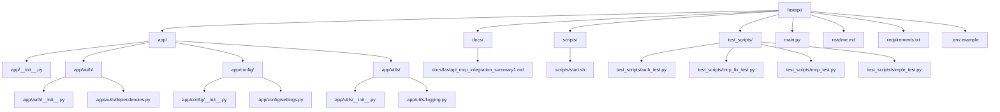

# FastAPI 项目开发指南

## 1. 引言

### 1.1 项目概述
该FastAPI项目采用模块化结构，主要业务逻辑和配置被组织在 `app/` 目录下。它是一个无状态的HTTP服务，专注于暴露API端点，并通过 `fastapi_mcp` 库将这些API端点转换为Model Context Protocol (MCP) 工具，从而使AI代理能够调用这些API。

### 1.2 目标读者
本指南面向所有参与FastAPI项目开发的人员，包括新入职的团队成员和核心开发人员。

### 1.3 如何使用本指南
本指南分为多个章节，涵盖了从环境搭建到部署运维的各个方面。建议新成员按顺序阅读，核心开发人员可将其作为日常参考手册。

## 2. 环境搭建

### 2.1 Python 版本要求
本项目的Python版本要求为 `Python 3.9+`。请确保您的开发环境满足此要求。

### 2.2 依赖安装（`requirements.txt`）
项目的所有依赖项都列在 [`requirements.txt`](requirements.txt) 文件中。请使用以下命令安装：
```bash
pip install -r requirements.txt
```

### 2.3 虚拟环境设置
强烈建议使用虚拟环境进行开发，以避免依赖冲突。
创建并激活虚拟环境：
```bash
python -m venv venv
source venv/bin/activate
```
（Windows用户可能需要使用 `venv\Scripts\activate`）

### 2.4 配置管理（`.env`文件、`app/config/settings.py`）
项目配置通过环境变量和 [`app/config/settings.py`](app/config/settings.py) 管理。
*   `.env` 文件：用于存储敏感信息和本地开发配置。请参考 `.env.example` 创建您的 `.env` 文件。
*   [`app/config/settings.py`](app/config/settings.py)：定义了项目的Pydantic BaseSettings，从环境变量加载配置。

### 2.5 启动项目（`scripts/start.sh`）
使用 [`scripts/start.sh`](scripts/start.sh) 脚本启动项目：
```bash
chmod +x scripts/start.sh
./scripts/start.sh
```
此脚本通常会使用 `uvicorn` 启动FastAPI应用。

### 2.6 测试连接
服务启动后，您可以使用 `curl` 命令测试各个端点：

```bash
# 测试健康检查（公开访问）
curl http://localhost:1234/health

# 测试认证端点
# 请将 `sk-wuzhe12345` 替换为您的实际 FASTAPI_MCP_TOKEN
curl -H "Authorization: Bearer sk-wuzhe12345" http://localhost:1234/

# 测试SSE端点 (如果已实现)
# 请将 `sk-wuzhe12345` 替换为您的实际 FASTAPI_MCP_TOKEN
curl -H "Authorization: Bearer sk-wuzhe12345" http://localhost:1234/sse

# 测试MCP端点 (如果已实现)
# 请将 `sk-wuzhe12345` 替换为您的实际 FASTAPI_MCP_TOKEN
curl -H "Accept: text/event-stream" -H "Authorization: Bearer sk-wuzhe12345" http://localhost:1234/mcp
```
请注意，`http://localhost:1234` 是默认的应用地址和端口，您可能需要根据实际配置进行调整。

## 3. 项目结构概览

以下是项目主要目录和文件的概览：



*   [`app/`](app/) 目录：包含核心应用逻辑，每个子目录代表一个模块或功能区域。
*   [`app/auth/`](app/auth/)：处理用户认证和授权逻辑。
*   [`app/config/`](app/config/)：存放项目配置相关的代码。
*   [`app/utils/`](app/utils/)：存放通用工具函数和辅助类。
*   [`docs/`](docs/)：项目文档。
*   [`scripts/`](scripts/)：存放项目相关的 shell 脚本，如启动脚本。
*   [`test_scripts/`](test_scripts/)：存放所有测试文件。
*   [`main.py`](main.py)：FastAPI 应用的入口文件。
*   [`readme.md`](readme.md)：项目简介和快速开始指南。
*   [`requirements.txt`](requirements.txt)：项目依赖列表。

## 4. 核心概念与最佳实践

### 4.1 FastAPI 路由定义
项目中的主要 API 路由定义在 [`main.py`](main.py) 中，直接通过 `@app.get()` 等 HTTP 方法装饰器定义路径操作函数。目前没有使用 `APIRouter` 进行路由分组。

**主要 API 路由示例：**
*   `GET /`: 根路径，返回 "Hello World" 消息。需要认证。
*   `GET /health`: 健康检查接口。公开访问。
*   `GET /hello/{name}`: 个性化问候接口。需要认证。

**路由定义示例（来自 [`main.py`](main.py)）：**
```python
@app.get("/", operation_id="say_hello", dependencies=[Depends(get_current_user)])
async def root() -> dict[str, str]:
    """根路径，返回 Hello World"""
    logger.info("访问根路径 /")
    return {"message": "Hello World"}

@app.get("/health", operation_id="health_check")
async def health_check() -> dict[str, str]:
    """健康检查接口"""
    logger.info("执行健康检查 /health")
    return {"status": "ok"}

@app.get("/hello/{name}", operation_id="say_hello_name", dependencies=[Depends(get_current_user)])
async def say_hello_name(name: str) -> dict[str, str]:
    """个性化问候接口"""
    logger.info(f"访问个性化问候接口 /hello/{name}")
    return {"message": f"Hello {name}"}
```
*   `@app.get()`: 用于定义处理 GET 请求的路由。
*   `operation_id`: 用于为 MCP 工具提供一个唯一的名称。
*   `dependencies=[Depends(get_current_user)]`: 表示该路由需要通过 `get_current_user` 依赖项进行认证。
*   路径参数：如 `/hello/{name}` 中的 `{name}`，FastAPI 会自动将其作为函数参数 `name: str` 传入。

### 4.2 请求体、查询参数、路径参数
在FastAPI中，请求数据可以通过路径参数、查询参数和请求体等多种方式接收。本项目主要使用了路径参数和Header参数进行认证。

*   **路径参数 (Path Parameters)**
    *   通过在路由路径中使用花括号 `{参数名}` 来定义，例如 `/hello/{name}`。
    *   在路径操作函数中，声明一个同名的函数参数，FastAPI 会自动从 URL 路径中提取对应的值并进行类型转换。
    *   示例：在 `/hello/{name}` 路由中，`name: str` 就是一个路径参数。

*   **查询参数 (Query Parameters)**
    *   通过在路径操作函数中声明不属于路径参数的额外参数来定义。FastAPI 会自动解析 URL 中 `?` 后面的查询字符串。
    *   本项目目前没有显式使用查询参数。

*   **请求体 (Request Body)**
    *   当需要接收客户端发送的复杂数据（如 JSON 对象）时，可以在路径操作函数中声明一个 Pydantic `BaseModel` 类型的参数。FastAPI 会自动读取请求体并将其反序列化为 Pydantic 模型实例。
    *   本项目目前没有显式定义复杂的请求体模型。如果需要，您可以通过导入 `BaseModel` 并定义您的数据结构来使用。

*   **Header 参数 (Header Parameters)**
    *   通过 `fastapi.Header` 声明函数参数来访问请求头中的信息。
    *   示例：在认证依赖项 [`app/auth/dependencies.py`](app/auth/dependencies.py) 中，`authorization: str = Header(None)` 用于获取 `Authorization` 请求头。

### 4.3 响应模型（Pydantic）
FastAPI 利用 Pydantic 来进行数据验证、序列化和自动生成 OpenAPI 文档。

*   **当前项目实践**：本项目没有显式使用 Pydantic `BaseModel` 定义复杂的响应模型。API 端点的响应类型直接使用 Python 的类型提示 `dict[str, str]`，FastAPI 会自动将其序列化为 JSON 响应。

*   **Pydantic `BaseModel` 的作用（通用实践）**：
    *   **数据验证**：通过定义 Pydantic 模型，可以确保 API 返回的数据结构和类型符合预期。
    *   **自动文档**：Pydantic 模型会自动集成到 OpenAPI (Swagger UI) 文档中，清晰地展示 API 的响应结构。
    *   **数据序列化**：Pydantic 可以方便地将 Python 对象转换为 JSON 格式，或将 JSON 数据反序列化为 Python 对象。

*   **示例（如果需要定义响应模型）**：
    ```python
    from pydantic import BaseModel

    class Item(BaseModel):
        name: str
        description: str | None = None
        price: float
        tax: float | None = None

    @app.get("/items/{item_id}", response_model=Item)
    async def read_item(item_id: int):
        return {"name": "Foo", "price": 42.0}
    ```
    通过 `response_model=Item`，FastAPI 会确保返回的数据符合 `Item` 模型的结构。

### 4.4 依赖注入
FastAPI 的依赖注入 (Dependency Injection, DI) 系统是其核心特性之一，它使得代码模块化、可测试性强且易于维护。

*   **工作原理**：
    *   在路径操作函数中声明带有类型提示的参数。
    *   使用 `fastapi.Depends()` 将一个可调用对象（函数、类或 `Depends` 实例）标记为依赖项。
    *   FastAPI 会在调用路径操作函数之前自动解析并提供这些依赖项。

*   **本项目中的使用**：
    *   本项目广泛使用了依赖注入，主要用于认证。
    *   [`app/auth/dependencies.py`](app/auth/dependencies.py) 中的 `get_current_user` 函数被定义为一个依赖项，用于验证请求的 `Authorization` 头。
    *   在 [`main.py`](main.py) 的路由中，通过 `dependencies=[Depends(get_current_user)]` 将 `get_current_user` 依赖项注入到需要保护的端点中。

*   **依赖项示例**：
    ```python
    # app/auth/dependencies.py
    from fastapi import Header, HTTPException, Depends
    import logging

    logger = logging.getLogger(__name__)

    def get_current_user(authorization: str = Header(None)) -> bool:
        """
        验证 Authorization 头是否像 "Bearer <token>" 并与 FASTAPI_MCP_TOKEN 匹配。
        如果验证失败，将抛出 HTTPException。
        """
        if authorization is None:
            logger.warning("Missing Authorization header")
            raise HTTPException(status_code=401, detail="Missing Authorization header")

        token = os.getenv("FASTAPI_MCP_TOKEN")
        if not token:
            logger.error("FASTAPI_MCP_TOKEN 环境变量未设定")
            raise HTTPException(status_code=500, detail="Server configuration error")

        expected = f"Bearer {token}"
        if authorization != expected:
            logger.warning(f"Invalid token received: {authorization[:20]}...")
            raise HTTPException(status_code=401, detail="Invalid token")

        logger.info("Token authentication successful")
        return True

    # main.py
    @app.get("/", operation_id="say_hello", dependencies=[Depends(get_current_user)])
    async def root() -> dict[str, str]:
        """根路径，返回 Hello World"""
        logger.info("访问根路径 /")
        return {"message": "Hello World"}
    ```
    当请求访问 `/` 路径时，FastAPI 会自动调用 `get_current_user` 依赖项来验证 `Authorization` 头。

*   **依赖项的范围**：
    *   FastAPI 会根据请求的生命周期自动管理依赖项。默认情况下，依赖项在每个请求中都会被调用。
    *   如果依赖项有返回值，其返回值可以作为参数传递给路径操作函数或其他依赖项。

### 4.5 错误处理
FastAPI 提供了一套强大且灵活的错误处理机制，允许您优雅地处理 API 中的各种异常情况。

*   **HTTPException**：
    *   在本项目中，主要的错误处理方式是在依赖项 [`app/auth/dependencies.py`](app/auth/dependencies.py) 中直接抛出 `HTTPException`。
    *   `HTTPException` 允许您指定 HTTP 状态码 (`status_code`) 和详细信息 (`detail`)。
    *   当 `HTTPException` 被抛出时，FastAPI 会自动捕获它，并返回一个符合 OpenAPI 规范的 JSON 错误响应。
    *   **示例（来自 [`app/auth/dependencies.py`](app/auth/dependencies.py)）：**
        ```python
        from fastapi import HTTPException

        # ...
        if authorization is None:
            raise HTTPException(status_code=401, detail="Missing Authorization header")
        # ...
        if not token:
            raise HTTPException(status_code=500, detail="Server configuration error")
        # ...
        if authorization != expected:
            raise HTTPException(status_code=401, detail="Invalid token")
        return True
        ```

*   **默认异常处理**：
    *   对于未被 `HTTPException` 或自定义异常处理器捕获的其他 Python 异常（例如 `ValueError`、`TypeError`），FastAPI 将使用其默认的内部错误处理机制，通常会返回一个 500 Internal Server Error 响应。

*   **自定义异常处理器 (`@app.exception_handler`)**：
    *   本项目目前没有显式定义全局或自定义的异常处理器。
    *   在更复杂的场景中，您可以使用 `@app.exception_handler` 装饰器为特定的异常类型（包括 `RequestValidationError` 用于处理 Pydantic 验证错误）定义自定义的响应逻辑，从而提供更友好的错误信息或执行特定的日志记录。
    *   **示例（自定义验证错误处理器）：**
        ```python
        from fastapi import FastAPI, Request, status
        from fastapi.responses import JSONResponse
        from fastapi.exceptions import RequestValidationError

        @app.exception_handler(RequestValidationError)
        async def validation_exception_handler(request: Request, exc: RequestValidationError):
            return JSONResponse(
                status_code=status.HTTP_422_UNPROCESSABLE_ENTITY,
                content={"detail": exc.errors(), "body": exc.body},
            )
        ```

### 4.6 日志记录
项目采用统一的日志记录策略，通过 [`app/utils/logging.py`](app/utils/logging.py) 模块进行集中配置和管理，确保应用行为的可追溯性和问题诊断的便利性。

*   **日志配置 (`setup_logging` 函数)**：
    *   **自动目录创建**：`setup_logging` 函数会自动检查并创建 `logs/` 目录（如果不存在），用于存放日志文件。
    *   **多目标输出**：日志同时输出到文件 (`logs/app.log`) 和控制台，便于开发调试和生产环境监控。
    *   **可配置级别**：日志级别（如 `INFO`, `DEBUG`, `WARNING`, `ERROR`）可以通过参数传入，默认级别为 `INFO`，允许在不同环境中灵活调整。
    *   **统一格式**：日志格式统一为 `%(asctime)s - %(name)s - %(levelname)s - %(message)s`，确保日志信息清晰、一致。
    *   **示例（来自 [`app/utils/logging.py`](app/utils/logging.py)）：**
        ```python
        import logging
        import os
        from datetime import datetime

        def setup_logging(log_file: str = "logs/app.log", log_level: str = "INFO") -> None:
            os.makedirs(os.path.dirname(log_file), exist_ok=True)
            logging.basicConfig(
                level=getattr(logging, log_level.upper()),
                format='%(asctime)s - %(name)s - %(levelname)s - %(message)s',
                handlers=[
                    logging.FileHandler(log_file), # 输出到文件
                    logging.StreamHandler()        # 输出到控制台
                ]
            )
            logger = logging.getLogger(__name__)
            logger.info(f"日志系统初始化完成 - {datetime.now().isoformat()}")
        ```

*   **日志器获取 (`get_logger` 函数)**：
    *   [`app/utils/logging.py`](app/utils/logging.py) 提供了 `get_logger` 函数，方便在项目的任何模块中获取指定名称的日志器实例。
    *   **示例**：在 [`main.py`](main.py) 中，通过 `logger = get_logger(__name__)` 获取日志器，并用于记录应用事件，如：`logger.info("访问根路径 /")`。
    *   这种方式确保了日志器的正确配置和在整个应用中的一致使用。

*   **最佳实践**：
    *   **按模块命名日志器**：使用 `get_logger(__name__)` 可以让日志记录器以当前模块的名称命名，有助于追踪日志来源。
    *   **选择合适的日志级别**：在开发环境中使用 `DEBUG` 或 `INFO` 级别获取详细信息，在生产环境中使用 `WARNING` 或 `ERROR` 级别以减少日志量并关注关键问题。
    *   **避免在日志中记录敏感信息**：日志不应包含用户的密码、个人身份信息等敏感数据。

## 5. 数据模型与数据库交互

### 5.1 ORM 选择
经过代码库搜索，当前 FastAPI 项目未集成任何 ORM（对象关系映射）工具，例如 SQLAlchemy 或 Pydantic-SQLAlchemy。
**选择理由**：本项目目前是一个无状态的 HTTP 服务，专注于暴露 API 端点和 MCP 工具，不涉及数据库交互。因此，无需选择和集成 ORM。

### 5.2 模型定义
由于本项目未集成数据库，因此没有定义任何数据库模型。
如果未来需要引入数据库，可以根据所选的 ORM（如 SQLAlchemy）来定义数据模型，包括表结构、字段类型、主键、外键以及表之间的关系。

### 5.3 数据库会话管理
由于本项目未集成数据库，因此不涉及数据库会话管理。
在集成数据库的 FastAPI 项目中，通常会使用依赖注入来管理数据库会话（例如 SQLAlchemy 的 `Session`），确保每个请求都有一个独立的会话，并在请求结束后自动关闭。

### 5.4 迁移策略
由于本项目未集成数据库，因此不涉及数据库迁移策略。
在需要数据库迁移的项目中，通常会使用 Alembic 等工具来管理数据库模式的演变，包括创建迁移脚本、应用迁移和回滚迁移。

## 6. 认证与授权

### 6.1 认证流程
本项目采用基于 Token 的认证流程，通过 HTTP `Authorization` 头进行身份验证。

*   **认证机制**：
    *   **依赖项**：认证逻辑封装在 [`app/auth/dependencies.py`](app/auth/dependencies.py) 中的 `get_current_user` 函数中。
    *   **Token 验证**：该函数期望请求头中包含 `Authorization: Bearer <token>` 格式的令牌。
    *   **环境变量配置**：`get_current_user` 会将提取的 `<token>` 与从环境变量 `FASTAPI_MCP_TOKEN` 获取的预设 Token 进行比对。
    *   **错误处理**：
        *   如果 `Authorization` 头缺失或格式不正确，将抛出 `HTTPException` (401 Unauthorized)。
        *   如果 `FASTAPI_MCP_TOKEN` 环境变量未设置，将抛出 `HTTPException` (500 Internal Server Error)。
        *   如果提供的 Token 与预设 Token 不匹配，将抛出 `HTTPException` (401 Unauthorized)。
    *   **集成**：需要认证的 API 路由通过 `dependencies=[Depends(get_current_user)]` 将此认证依赖项注入，确保只有经过验证的请求才能访问受保护的端点。

*   **示例（来自 [`app/auth/dependencies.py`](app/auth/dependencies.py)）：**
    ```python
    import os
    import logging
    from fastapi import Header, HTTPException, Depends

    logger = logging.getLogger(__name__)

    def get_current_user(authorization: str = Header(None)) -> bool:
        if authorization is None:
            logger.warning("Missing Authorization header")
            raise HTTPException(status_code=401, detail="Missing Authorization header")

        token = os.getenv("FASTAPI_MCP_TOKEN")
        if not token:
            logger.error("FASTAPI_MCP_TOKEN 环境变量未设定")
            raise HTTPException(status_code=500, detail="Server configuration error")

        expected = f"Bearer {token}"
        if authorization != expected:
            logger.warning(f"Invalid token received: {authorization[:20]}...")
            raise HTTPException(status_code=401, detail="Invalid token")

        logger.info("Token authentication successful")
        return True
    ```

### 6.2 授权策略
本项目目前实现了基于 Token 的简单认证，但没有实现复杂的授权策略，例如基于角色的访问控制 (RBAC) 或基于权限的访问控制。

*   **当前授权策略**：
    *   任何持有有效 `FASTAPI_MCP_TOKEN` 的用户都被视为已认证，并可以访问所有受保护的 API 端点。
    *   这意味着授权仅限于验证用户是否提供了正确的 Token，而不区分用户的角色或具体权限。

*   **未来扩展（通用实践）**：
    *   如果项目需要更细粒度的授权控制，可以考虑引入 RBAC 或基于权限的授权机制。
    *   这通常涉及定义用户角色（如管理员、普通用户）、为角色分配权限，并在依赖项中检查当前用户的角色或权限，以决定是否允许访问特定资源或执行特定操作。
    *   可以通过创建额外的依赖项来检查用户的角色或权限，并将其与 `get_current_user` 依赖项结合使用。

## 7. 测试

### 7.1 单元测试
本项目没有显式区分单元测试和集成测试，所有测试用例均存放在 [`test_scripts/`](test_scripts/) 目录下。

*   **编写规范**：
    *   测试文件以 `_test.py` 结尾，例如 [`auth_test.py`](test_scripts/auth_test.py)、[`mcp_test.py`](test_scripts/mcp_test.py)、[`simple_test.py`](test_scripts/simple_test.py)。
    *   每个测试文件通常定义一个测试类（如 `AuthTests`、`MCPTests`），其中包含多个测试方法（以 `test_` 开头），这与 Pytest 的测试发现规则兼容。
    *   测试用例主要通过 `requests` 库发送 HTTP 请求来验证 API 端点的行为。

*   **测试工具**：
    *   项目使用了 `requests` 库进行 HTTP 请求，并手动实现了测试结果的记录和报告生成。
    *   目前没有直接依赖于 Pytest 等完整的测试框架进行测试运行和结果断言，但测试脚本的结构遵循了测试用例的组织方式。
    *   没有发现明确的测试覆盖率工具（如 Coverage.py）的配置或使用痕迹。

### 7.2 集成测试
（同上，本项目未显式区分单元测试和集成测试，请参考“7.1 单元测试”部分）

### 7.3 如何运行测试
由于本项目没有集成 Pytest 等测试运行器，因此无法通过单一命令运行所有测试。
您可以根据 [`test_scripts/`](test_scripts/) 目录下的文件，通过直接运行 Python 脚本来执行测试。

**运行单个测试文件示例**：
```bash
python test_scripts/auth_test.py
python test_scripts/mcp_test.py
python test_scripts/simple_test.py
```
开发者需要手动运行每个测试脚本来执行测试。

## 8. 部署与运维

### 8.1 部署流程概述
项目提供了一个便捷的启动脚本和清晰的环境配置机制，部署流程相对简单，适用于小型项目或开发环境。

*   **启动流程**：
    *   `scripts/start.sh`: 这是一个 Bash 脚本，用于自动化应用的启动过程。
        1.  `cd "$(dirname "$0")/.."`: 切换到项目根目录，确保脚本在正确的位置执行。
        2.  **虚拟环境管理**: 检查 `.venv` 目录是否存在，如果不存在则创建并激活 Python 虚拟环境。
        3.  **依赖安装**: `pip install -r requirements.txt`，确保所有必要的 Python 依赖都已安装。
        4.  **日志目录创建**: `mkdir -p logs`，创建日志文件存放目录。
        5.  **应用启动**: `python main.py`，执行主应用文件。[`main.py`](main.py) 内部使用 `uvicorn.run` 启动 ASGI 服务器。

*   **部署相关的配置或脚本**：
    *   `requirements.txt`: 明确列出了项目的所有 Python 依赖，便于在任何环境中安装。
    *   `.env.example` 和 `.env`: 提供了环境变量的示例和实际配置机制，方便在不同环境中配置应用参数。
    *   [`app/config/settings.py`](app/config/settings.py): 通过 `python-dotenv` 库加载 `.env` 文件中的配置，使得应用可以在不修改代码的情况下适应不同的部署环境。

*   **容器化或 CI/CD 线索**：
    *   目前的代码库中没有直接的 Dockerfile、Docker Compose 文件或 CI/CD 配置文件（如 `.github/workflows/`）。
    *   对于生产环境，可能需要考虑更复杂的部署方案，如 Docker 容器化、Kubernetes 编排、Nginx/Gunicorn 反向代理等。

### 8.2 环境配置
项目配置通过环境变量和 [`app/config/settings.py`](app/config/settings.py) 管理，支持在不同部署环境（开发、测试、生产）中灵活配置。

*   **配置加载机制**：
    *   [`app/config/settings.py`](app/config/settings.py) 中的 `Settings` 类负责加载和管理所有应用配置。
    *   它利用 `python-dotenv` 库的 `load_dotenv()` 函数在应用启动时自动加载项目根目录下的 `.env` 文件中的环境变量。
    *   配置项包括 `app_name`、`app_version`、`app_description`、`token` (FASTAPI_MCP_TOKEN)、`host`、`port`、`log_level`。
    *   如果强制要求的 `FASTAPI_MCP_TOKEN` 未设置，会抛出 `RuntimeError`。

*   **不同部署环境**：
    *   **开发环境**：通常设置 `RELOAD=True` 以启用代码重载，`LOG_LEVEL=debug` 以获取详细日志，`HOST=0.0.0.0` 和 `PORT=8000` 以便本地访问。
    *   **测试环境**：配置与开发环境类似，但可能使用不同的 `FASTAPI_MCP_TOKEN` 和数据库配置（如果有）。
    *   **生产环境**：设置 `RELOAD=False` 以提高性能，`LOG_LEVEL=info` 或 `warning` 以减少日志量，`HOST=0.0.0.0` 和 `PORT=80` 或 `443` 以支持外部访问，使用安全的 `FASTAPI_MCP_TOKEN`。

*   **注意事项**：
    *   **敏感信息管理**：`FASTAPI_MCP_TOKEN` 等敏感信息应通过环境变量或安全的秘密管理方案（如 Kubernetes Secrets, AWS Secrets Manager）进行管理，避免在代码中硬编码。
    *   **环境变量优先级**：`.env` 文件中的配置会覆盖默认值，但系统环境变量优先级更高。
    *   **配置验证**：在生产环境中，确保所有必需的环境变量都已设置，否则应用会启动失败。

### 8.3 运维注意事项
*   **日志监控**：[`app/utils/logging.py`](app/utils/logging.py) 配置了日志输出到文件 (`logs/app.log`) 和控制台，这对于在生产环境中监控应用状态、诊断问题至关重要。
*   **环境变量管理**：敏感信息（如 `FASTAPI_MCP_TOKEN`）通过环境变量进行管理，提高了安全性。在生产环境中，应使用更安全的秘密管理方案（如 Kubernetes Secrets, AWS Secrets Manager 等）。
*   **虚拟环境**：启动脚本强制使用虚拟环境，保证了依赖隔离和环境一致性。
*   **简单部署**：目前的部署策略相对简单，适用于小型项目或开发环境。对于生产环境，可能需要考虑更复杂的部署方案，如 Docker 容器化、Kubernetes 编排、Nginx/Gunicorn 反向代理等。

## 9. 代码贡献指南

### 9.1 代码规范与风格
项目在代码规范和文档方面具有一定的实践。

*   **代码规范与风格**：
    *   项目中没有发现 `.editorconfig` 或 `pyproject.toml` 文件，因此没有显式配置 Black、isort 等自动化代码格式化工具。
    *   尽管如此，代码整体风格保持一致，遵循 Python PEP 8 规范（例如 4 空格缩进、空行使用等）。

*   **docstrings 的使用**：
    *   在核心模块（如 `app/auth/dependencies.py` 和 `app/utils/logging.py`）的函数和模块级别，使用了清晰的 `docstrings` 来描述其功能、参数和返回值，极大地提高了代码的可读性和可维护性。

### 9.2 Git 工作流
项目当前没有明确的 Git 工作流文档或配置（如 `.github/workflows/` 中的 CI/CD 工作流）。建议采用 GitHub Flow 或 Git Flow 作为标准工作流。

*   **推荐 Git Flow**：
    *   **主分支**：`main` - 生产分支，始终保持稳定。
    *   **开发分支**：`develop` - 开发分支，用于集成新功能。
    *   **特性分支**：`feature/<feature-name>` - 为每个新功能创建分支，从 `develop` 分支拉取。
        *   **发布分支**：`release/<version>` - 用于准备发布，从 `develop` 分支拉取。
    *   **热修复分支**：`hotfix/<issue-name>` - 用于紧急修复，从 `main` 分支拉取。
    *   **提交消息规范**：使用 Conventional Commits 格式，例如 `feat: add user authentication`、`fix: resolve token validation bug`、`docs: update README with new features`。

### 9.3 文档编写（docstrings）
本项目鼓励使用 docstrings 来文档化代码，提高可读性和可维护性。

*   **编写规范**：
    *   使用 Google 或 NumPy 风格的 docstrings。
    *   对于函数，描述功能、参数、返回值。
    *   示例：
        ```python
        def get_current_user(authorization: str = Header(None)) -> bool:
            """
            验证 Authorization 头是否像 "Bearer <token>" 并与 FASTAPI_MCP_TOKEN 匹配。

            Args:
                authorization: HTTP Authorization 头。

            Returns:
                bool: 验证成功返回 True，否则抛出异常。
            """
        ```
    *   模块级 docstrings 描述模块目的。
    *   工具如 Sphinx 可以用于生成 API 文档。

## 10. 常见问题解答 (FAQ)

*   **Q: 如何设置 FASTAPI_MCP_TOKEN？**
    *   A: 在 `.env` 文件中添加 `FASTAPI_MCP_TOKEN=your-secret-token`。确保在所有环境中设置此变量，否则应用启动时会抛出错误。

*   **Q: 为什么 API 端点返回 401 Unauthorized？**
    *   A: 检查请求头是否包含正确的 `Authorization: Bearer <token>`，并确保 token 与 `.env` 中的 `FASTAPI_MCP_TOKEN` 匹配。验证日志以获取更多细节。

*   **Q: 如何运行测试？**
    *   A: 手动运行 `python test_scripts/<test_file>.py`。考虑集成 Pytest 以简化测试执行。

*   **Q: 日志文件在哪里？**
    *   A: 日志文件位于 `logs/app.log`。如果目录不存在，启动脚本会自动创建。

*   **Q: 如何扩展项目以支持数据库？**
    *   A: 集成 SQLAlchemy 或 Tortoise-ORM，定义模型，更新 `requirements.txt`，并在 `main.py` 中配置数据库连接。