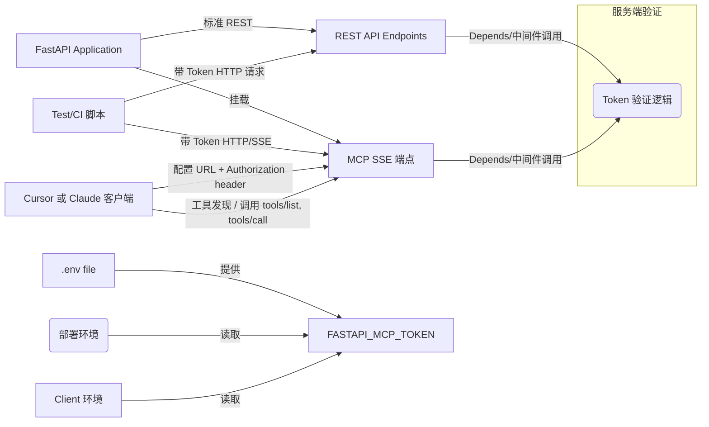

下面是一份 **超全** 的方案报告，说明如何在现有的 FastAPI 应用中集成 MCP + SSE + token 验证，以及客户端如何测试与添加 MCP（以 Cursor/Claude 为例）。我也画了 mermaid 图来说明各部分之间的关系／流程。你可以把它当作部署文档或内部设计文档使用。

---

# 完整方案报告：给已有 FastAPI 应用加 MCP SSE 服务 + Token 验证 + 客户端测试与接入

---

## 一、目标

把你的现有 FastAPI 应用（当前提供 `/`, `/health`, `/hello/{name}` 等端点）增强为支持 MCP SSE（Model Context Protocol over Server-Sent Events）服务，并加入 API Key / Token 验证机制。然后在客户端（测试脚本／Cursor／Claude CLI）完整地测试与注册这个 MCP 服务。

---

## 二、架构组件与关系图

下面是系统中各组件的高层关系和通信流程：



说明：

* 服务端把原有 REST 接口继续保留；
* 新增 MCP SSE 路径 `/sse`（建立 SSE 会话并推 events）和 `/sse/messages?session_id=...`（客户端 POST 控制消息/工具调用）；
* 在所有 REST 与 MCP 路径上加入统一的 Token 验证逻辑（Authorization header）；
* 环境变量 `.env` 用于部署环境与调试环境中注入 `FASTAPI_MCP_TOKEN`；
* 客户端与 Cursor/Claude 注册 MCP 服务时要提供 URL + token header。

---

## 三、服务端方案

### 3.1 环境与依赖

* Python 3.12+
* `fastapi`, `uvicorn`, `fastapi_mcp`（用于 MCP SSE 支持）
* `python-dotenv`（加载 `.env` 文件）
* 可选：`pydantic` 的 `BaseSettings`（结构更清晰管理配置）

```bash
pip install fastapi uvicorn fastapi_mcp python-dotenv
```

### 3.2 文件结构示例

```
your_project/
  main.py
  .env
  logs/
  requirements.txt
```

### 3.3 `.env` 文件

在项目根目录下创建 `.env`（并加入 `.gitignore`），内容：

```
FASTAPI_MCP_TOKEN=sk-wuzhe12345
```

### 3.4 服务端代码示例（`main.py`）

下面是完整代码示例，集成 Token 验证 + MCP SSE + REST 接口。

```python
# main.py

import os
from fastapi import FastAPI, Header, HTTPException, Depends
from fastapi_mcp import FastApiMCP
from dotenv import load_dotenv
import logging
from datetime import datetime

# 加载 .env 文件
load_dotenv()

# 获取 token
TOKEN = os.getenv("FASTAPI_MCP_TOKEN")
if not TOKEN:
    raise RuntimeError("FASTAPI_MCP_TOKEN 环境变量未设定")

# 日志配置
logging.basicConfig(
    level=logging.INFO,
    format="%(asctime)s - %(name)s - %(levelname)s - %(message)s",
    handlers=[
        logging.FileHandler("logs/app.log"),
        logging.StreamHandler()
    ]
)
logger = logging.getLogger(__name__)

app = FastAPI(
    title="FastAPI MCP SSE Server with Token",
    version="1.0.0",
    description="现有 FastAPI + MCP SSE 服务，带 Token 验证"
)

# 认证依赖
def check_token(authorization: str = Header(None)):
    """
    验证 Authorization 头是否像 "Bearer <token>" 并与 FASTAPI_MCP_TOKEN 匹配
    """
    if authorization is None:
        logger.warning("Missing Authorization header")
        raise HTTPException(status_code=401, detail="Missing Authorization header")
    expected = f"Bearer {TOKEN}"
    if authorization != expected:
        logger.warning(f"Invalid token received: {authorization}")
        raise HTTPException(status_code=401, detail="Invalid token")
    # 验证通过

# REST endpoints with token验证

@app.get("/", operation_id="say_hello", dependencies=[Depends(check_token)])
async def root() -> dict[str, str]:
    logger.info("访问根路径 /")
    return {"message": "Hello World"}

@app.get("/health", operation_id="health_check", dependencies=[Depends(check_token)])
async def health_check() -> dict[str, str]:
    logger.info("访问 /health")
    return {
        "status": "healthy",
        "timestamp": datetime.utcnow().isoformat() + "Z",
        "service": "fastapi-mcp-sse-server"
    }

@app.get("/hello/{name}", operation_id="greet_user", dependencies=[Depends(check_token)])
async def greet_user(name: str) -> dict[str, str]:
    logger.info(f"访问 /hello/{name}")
    return {"message": f"Hello, {name}!"}

# MCP SSE 部分

mcp = FastApiMCP(app)

# mount_sse 方法是否支持 dependencies 参数取决于 fastapi_mcp 库版本。
# 如果支持，可以这样做：
try:
    mcp.mount_sse(dependencies=[Depends(check_token)])
    logger.info("MCP SSE 挂载成功，带 token 验证")
except TypeError:
    # 如果不支持 dependencies，可能需要手动在内部实现检查
    logger.warning("mcp.mount_sse 不支持 dependencies 参数 — 请确保 /sse 与 /sse/messages 路径有 token 验证中间件或路由级别的 Depends(check_token)")

# 启动
if __name__ == "__main__":
    import uvicorn
    uvicorn.run("main:app", host="0.0.0.0", port=1234, log_level="info")
```

### 3.5 验证与调试

* 启动服务前确保 `.env` 文件存在且 `FASTAPI_MCP_TOKEN=sk-wuzhe12345`；
* `.env` 若不在生产环境，请确认已经被加载（`dotenv.load_dotenv()` 调用）；
* 检查日志输出，看是否抛出 RuntimeError；

---

## 四、客户端／测试与接入方案

客户端可以分为：

* **测试脚本**（Python / curl）
* **Cursor 或 Claude 客户端配置**

### 4.1 测试脚本

在项目中新建一个 `tests/` 文件夹，例如 `tests/test_mcp_with_token.py`，内容如下：

```python
# tests/test_mcp_with_token.py

import os
import time
import json
import requests
from sseclient import SSEClient
from dotenv import load_dotenv

load_dotenv()

TOKEN = os.getenv("FASTAPI_MCP_TOKEN", "sk-wuzhe12345")
BASE = "http://mini.ewuzhe.dpdns.org:1234"
SSE_URL = f"{BASE}/sse"
MSG_URL = f"{BASE}/sse/messages/"

headers = {
    "Authorization": f"Bearer {TOKEN}"
}

def open_session_and_get_id(timeout=10):
    resp = requests.get(SSE_URL, stream=True, headers=headers, timeout=timeout)
    client = SSEClient(resp)
    start = time.time()
    for ev in client.events():
        # ev.data 通常是 JSON 字符串
        try:
            d = json.loads(ev.data)
            if isinstance(d, dict) and "session_id" in d:
                return d["session_id"]
        except Exception:
            pass
        if time.time() - start > timeout:
            raise TimeoutError("No session_id received in SSE stream")
    raise RuntimeError("SSE connection closed without session_id")

def call_tools_list(session_id):
    payload = {
        "jsonrpc": "2.0",
        "id": 1,
        "method": "tools/list",
        "params": {}
    }
    resp = requests.post(f"{MSG_URL}?session_id={session_id}", json=payload, headers=headers, timeout=10)
    resp.raise_for_status()
    return resp.json()

def call_greet_user(session_id, name="测试"):
    payload = {
        "jsonrpc": "2.0",
        "id": 2,
        "method": "tools/call",
        "params": {
            "name": "greet_user",
            "arguments": { "name": name }
        }
    }
    resp = requests.post(f"{MSG_URL}?session_id={session_id}", json=payload, headers=headers, timeout=10)
    resp.raise_for_status()
    return resp.json()

if __name__ == "__main__":
    sid = open_session_and_get_id()
    print("Session ID:", sid)
    res = call_tools_list(sid)
    print("tools/list:", res)
    res2 = call_greet_user(sid, name="张三")
    print("tools/call greet_user:", res2)
```

也可以写成 `pytest` 测试格式。

### 4.2 curl 测试

```bash
# 测试 REST 端点, 无 token -> 应返回 401
curl -i http://mini.ewuzhe.dpdns.org:1234/health

# 测试 REST 端点, 带 token
curl -i -H "Authorization: Bearer sk-wuzhe12345" http://mini.ewuzhe.dpdns.org:1234/health

# 打开 SSE 流（带 token）
curl -N -H "Authorization: Bearer sk-wuzhe12345" http://mini.ewuzhe.dpdns.org:1234/sse

# POST tools/list
curl -X POST "http://mini.ewuzhe.dpdns.org:1234/sse/messages/?session_id=THE_SESSION_ID" \
  -H "Content-Type: application/json" \
  -H "Authorization: Bearer sk-wuzhe12345" \
  -d '{
        "jsonrpc": "2.0",
        "id": 1,
        "method": "tools/list",
        "params": {}
      }'
```

### 4.3 Cursor / Claude 客户端配置接入

#### Cursor：配置 MCP 服务

* 在 Cursor 的设置中 “MCP” → “Add new global MCP server”
* 填写配置（JSON 或表单），例如：

```json
{
  "mcpServers": {
    "mini-fastapi-mcp-sse": {
      "url": "http://mini.ewuzhe.dpdns.org:1234/sse",
      "headers": {
        "Authorization": "Bearer ${env:FASTAPI_MCP_TOKEN}"
      }
    }
  }
}

```

直接使用密码设置
```


    "mini-fastapi-mcp-sse": {
      "url": "http://mini.ewuzhe.dpdns.org:1234/sse",
      "headers": {
        "Authorization": "Bearer sk-wuzhe12345"
      }
    },
```

* 在你的开发机 / CI 环境中设置环境变量：

```bash
export FASTAPI_MCP_TOKEN="sk-wuzhe12345"
```

* 保存后 Cursor 应该能检测到该 MCP 服务并显示可用的工具列表（`say_hello`, `health_check`, `greet_user`）.

#### Claude Code CLI 示例

```bash
claude mcp add mini-fastapi --transport sse http://mini.ewuzhe.dpdns.org:1234/sse --scope project --env FASTAPI_MCP_TOKEN=sk-wuzhe12345
claude mcp list
claude mcp get mini-fastapi


# 作用域为用户(错误)
claude mcp add mini-fastapi --transport sse http://mini.ewuzhe.dpdns.org:1234/sse --scope user --env FASTAPI_MCP_TOKEN=sk-wuzhe12345


# 获取特定服务器的详细信息
claude mcp get mini-fastapi
# 删除服务器
claude mcp remove mini-fastapi


# 作用域为用户(正确)
# 这是最关键的区别。 这个标志告诉 Claude，在向该 URL 发送请求时，需要在 HTTP 请求的标头 (Header) 中加入一个名为 Authorization 的字段，其值为 Bearer sk-wuzhe12345。这是一种非常标准的 API 认证方式 (Bearer Token)。
claude mcp add mini-fastapi --transport sse http://mini.ewuzhe.dpdns.org:1234/sse --scope user --header "Authorization: Bearer sk-wuzhe12345"


# 客户端Claude code cli 的配置文件：C:\Users\Lenovo\.claude.json
    "mini-fastapi": {
      "type": "sse",
      "url": "http://mini.ewuzhe.dpdns.org:1234/sse",
      "headers": {
        "Authorization": "Bearer sk-wuzhe12345"
      }
    }


```

---

## 五、测试与验证流程

下面是建议的测试步骤 + 验收标准：

| 测试阶段                   | 操作                                             | 输入 /请求                                            | 预期输出 / 验收标准 |
| ---------------------- | ---------------------------------------------- | ------------------------------------------------- | ----------- |
| 环境准备                   | 启动服务器                                          | `.env` 中有 `FASTAPI_MCP_TOKEN=sk-wuzhe12345`       | 服务启动成功，无报错  |
| 无 token 请求 REST        | GET `/health` 无 Authorization                  | HTTP 状态码 401，返回错误信息                               |             |
| 错误 token 请求 REST       | Authorization: Bearer wrongToken               | HTTP 状态码 401                                      |             |
| 正确 token 请求 REST       | Authorization: Bearer sk-wuzhe12345            | HTTP 200，返回正确 JSON，例如 `{"status":"healthy", ...}` |             |
| SSE 流建立，无 token        | `curl -N /sse` 无 header                        | HTTP 401 或被拒绝／连接关闭                                |             |
| SSE 流建立，正确 token       | 带 header `Authorization: Bearer sk-wuzhe12345` | SSE 连接成功，首次 event 包含 `session_id`                 |             |
| tools/list 调用，无 token  | POST `/sse/messages/?session_id=...` 无 header  | HTTP 401 或 error JSON                             |             |
| tools/list 调用，正确 token | 带 header                                       | 返回 JSONrpc result，包含工具名称数组                        |             |
| tools/call 调用正确        | 调用 `greet_user` 方法带 name 参数                    | 返回 JSONrpc result，message 正确，比如 `Hello, 张三!`      |             |
| 客户端注册 / GUI 工具列表       | Cursor/Claude 注册 MCP                           | 工具列表能看到 `say_hello`, `health_check`, `greet_user` |             |
| 客户端工具调用                | 用客户端发起工具调用（例如 ask GPT / Cursor agent）          | 正确执行，返回预期工具内容                                     |             |

---

## 六、安全 + 运维考虑（Ultra Think 部分）

* **HTTPS**：生产环境必须启用 TLS，以防敏感 token 与会话 ID 被中间人截获。
* **Token 管理**：

  * 不要硬编码 token，尽量用 Secret 管理器或环境变量注入；
  * token 应该足够随机／复杂，不易暴露；
  * 若可能，引入 token 刷新或多个 token 支持（比如 rotate）。
* **日志安全**：不要把 token 明文写入日志；在验证失败时可以记录被请求的 header 的部分内容（mask 掩码）。
* **限制暴露工具范围**：可能你不想暴露所有 REST endpoints作为 MCP tools，通过 `include_tags` / `exclude_tags` / operation\_id 过滤工具接口。FastAPI MCP 支持这个。 ([apidog][1])
* **会话管理与清理**：对于 SSE session\_id，服务端需要管理活跃会话。如果某些 session 长时间未活动，应清理以释放资源。
* **CORS 设置**：如果客户端由前端浏览器访问，则要控制跨源资源共享 (CORS) 的配置，仅允许可信来源。
* **限流 /防滥用**：对工具调用次数与 SSE 连接数做监控与限制，避免被恶意刷爆。

---

## 七、版本管理与部署策略

* 使用版本控制（如 git）管理改动，尤其 `.env.example` 文件（示例 token，不是真实密钥）
* CI/CD 集成自动化测试脚本，部署前确保所有测试通过
* 在不同环境（开发 / 测试 / 预生产 / 生产）中使用不同 token /配置

---

## 八、总结

通过以上方案，你将获得：

1. 原有 REST 接口继续可用，且带安全验证
2. MCP + SSE 服务可被 AI 客户端使用（工具被发现 + 可调用）
3. 客户端与测试脚本能完整覆盖验证流程
4. 安全性与可维护性有保障

如果你愿意，我可以把这份报告生成一个 Markdown 或 PDF 文档供你发给团队／存档；或者我可以直接写出 “Pull Request diff” 示例，展示你的现有代码改动（补充 token 验证 + MCP SSE）让你直接合并。你要哪个版本？

[1]: https://apidog.com/blog/fastapi-mcp/?utm_source=chatgpt.com "How to Use FastAPI MCP Server - Apidog"


# CLAUDE CODE CLI 与你的服务器之间成功建立连接／健康检查

看起来你执行 `claude mcp add ...` 命令成功了（它说 “Added SSE MCP server mini-fastapi … File modified: /Users/zhewu/.mcp.json”），但是在 `claude mcp list` 时没有看到 “mini-fastapi” 显示 “✓ Connected”，而是没有提或者失败了。说明 “注册” 成功了，但 CLAUDE CODE CLI 与你的服务器之间还没成功建立连接／健康检查未通过。

我来帮你诊断可能的问题，并写一个修复方案。

---

## 诊断：可能为什么 “未安装成功 / 未连接成功”

下面是一些可能原因，以及如何验证：

| 原因                                              | 检查方法                                                                                                      | 可能的解决办法                                                                              |
| ----------------------------------------------- | --------------------------------------------------------------------------------------------------------- | ------------------------------------------------------------------------------------ |
| **服务端没有启动 / 地址不可达**                             | 在你本地或从 CLI 机器上用 `curl` 或 `telnet` 测试 `http://mini.ewuzhe.dpdns.org:1234/sse` 是否能访问（带 token 验证头或者不带头看访问情况） | 如果不通，要确认服务器在运行、网络安全组／防火墙／端口转发是否开放                                                    |
| **SSE 路径 `/sse` 或 `/sse/messages` 拒绝连接 / 认证错误** | 用 curl 带上 `Authorization: Bearer sk-wuzhe12345` 去访问看是否 HTTP 401 或者其他错误                                    | 如果是 401，说明服务端的 token 验证没正确设置；如果 404/500 则服务端路由可能没挂载正确或者 FastAPI MCP SSE mount 不在预期地方 |
| **服务端 SSE 流未正确返回 “session\_id”（MCP 协议初始化失败）**   | 使用 curl 或脚本建立 SSE 流看返回的数据中是否含有 session\_id 或 MCP 初始化 handshake                                            | 如果没有，则服务端 MCP SSE 实现可能没有暴露正确事件或错误                                                    |
| **Claude CLI 的健康检测失败**                          | `claude mcp list` 通常会进行一个健康检查／tools/list 或类似 call，看是否返回状态 OK                                              | 如果失败，CLI 会显示 “Failed to connect” 或类似信息，查看日志可能有更详细的错误消息                               |

---

## 修复方案

我建议按以下步骤来排查与修复，让 “mini-fastapi” 在 `claude mcp list` 中显示为 “✓ Connected”。

---

## 一、确认服务端正确支持 SSE + token + MCP

### 1. 确认服务在运行

在服务器机器上：

```bash
ps aux | grep uvicorn
# 或者看 uvicorn 日志里有没有 “Running on http://…” 这类信息
```

确认 `307` 端口（你用的 1234）有没有被绑定，以及从外部可以访问。你可从你的本地电脑（不是服务器）运行：

```bash
curl -v http://mini.ewuzhe.dpdns.org:1234/health
```

如果服务端有 token 验证，加上 header：

```bash
curl -v -H "Authorization: Bearer sk-wuzhe12345" http://mini.ewuzhe.dpdns.org:1234/health
```

若成功（HTTP 200 + JSON），说明 REST 部分正常。

### 2. 确认 SSE 流可以建立

使用 curl 或 Python 脚本带 token 访问 `/sse`：

```bash
curl -N -H "Authorization: Bearer sk-wuzhe12345" http://mini.ewuzhe.dpdns.org:1234/sse
```

你应该看到 SSE 事件（可能第一条 event 含 `session_id` 或其他初始化事件）。如果是 401 或连接中断，就说明 SSE 路由或 token 验证有问题。

### 3. POST /sse/messages?session\_id=… 验证工具发现

假设你拿到一个 `session_id`，则用下面命令：

```bash
curl -X POST "http://mini.ewuzhe.dpdns.org:1234/sse/messages/?session_id=PUT_YOUR_SESSION_ID_HERE" \
  -H "Content-Type: application/json" \
  -H "Authorization: Bearer sk-wuzhe12345" \
  -d '{
    "jsonrpc": "2.0",
    "id": 1,
    "method": "tools/list",
    "params": {}
  }'
```

看返回是否包含 `result` 和可用工具列表。如果不行，就看错误码／响应内容。

---

## 二、确认 Claude Code CLI 配置与状态

### 1. 查看 `.mcp.json` 内容

打开 `/Users/zhewu/.mcp.json` 或项目里的 `.mcp.json`，确认 “mini-fastapi” 的条目有没有包含：

* `url` 是正确的 `http://mini.ewuzhe.dpdns.org:1234/sse`
* 有 `headers` 部分，`Authorization` 字段正确
* `transport: sse` 被正确记住

例如：

```json

# claude code cli 添加sse mcp 的指令
claude mcp add mini-fastapi --transport sse http://mini.ewuzhe.dpdns.org:1234/sse --scope user --header "Authorization: Bearer sk-wuzhe12345"


{
  "mcpServers": {
    "mini-fastapi": {
      "url": "http://mini.ewuzhe.dpdns.org:1234/sse",
      "transport": "sse",
      "headers": {
        "Authorization": "Bearer ${env:FASTAPI_MCP_TOKEN}"
      },
      "scope": "project"
    }
  }
}
```

确认没有拼写错误。

### 2. 确认环境变量在 CLI 可见

在你运行 `claude mcp list` 或其他 `claude` 命令时，CLI 环境中要有环境变量被读取：

```bash
echo $FASTAPI_MCP_TOKEN
```

应该输出 `sk-wuzhe12345`。如果没设置（或者 CLI 不是从你设变量的那一 shell），CLI 发出的 header 可能是空／错误的。

如果你用 `--env FASTAPI_MCP_TOKEN=sk-wuzhe12345` 添加，CLI 提供的配置里应该存有这个 env 插值。你也可以把绝对的 token 值写在 `.mcp.json` 临时测试看效果（不安全，仅测试）。

### 3. 重试注册 /健康检查

有时 Claude Code 在第一次注册后做健康检查（例如调用 `tools/list` 初始化）如果失败，会在 `list` 时显示 “Failed to connect”。可能原因是服务端响应慢、或网络延迟、或 token 验证超时。

* 等几秒钟再 `claude mcp list` 看看是否变为连接成功状态。
* 确认服务器响应时间足够快（REST /tools/list 请求）

---

## 三、修复步骤建议

按照下面步骤操作：

1. **在服务器端确认 token 验证和 SSE 路径正确**

   * 可以临时添加一个 “无 token也允许访问” 的调试 REST endpoint，验证服务基础路径工作，再逐步打开 token 验证。
   * 检查 FastApiMCP SSE 挂载是否正确。查看 FastApiMCP 文档确认 `mount_sse` 可挂载 `/sse` 和 `/sse/messages` 路径。

2. **在本地用脚本测试**

   * 写 Python 脚本（像之前给的 `test_mcp_with_token.py`）来测试 SSE + tools/list + greet\_user，确保这些请求在带 token 的情况下能成功。

3. **在 Claude CLI 环境中确认环境变量**

   * 在你的 shell (你运行 `claude` 命令的那个 shell) 中执行 `export FASTAPI_MCP_TOKEN=sk-wuzhe12345`
   * 然后执行 `claude mcp get mini-fastapi` 看是否显示 headers 正确
   * 如果需要，也可以把 token 明文放入 `.mcp.json` 的 headers 临时测试

4. **重启 Claude Code / 或重新载入配置**

   * Claude Code 有时候缓存或健康检查失败会导致状态不变，要重启 CLI 或整个应用
   * 用 `claude mcp remove mini-fastapi` 然后重新 `claude mcp add …` 看是否状态有变化

---

## 四、可能的特殊情况

* 如果你的服务端是 HTTPS 而 CLI 用 HTTP，会被拒绝或者被浏览器／网络策略拦截。
* 如果存在跨域或代理 / DNS 问题，域名 `mini.ewuzhe.dpdns.org` 是否能从你运行 CLI 的机器上访问。
* 如果 token 验证逻辑有 bug（例如大小写敏感、前后空格、Bearer 前缀写错等）

---

如果你愿意，我可以帮你写一个 “诊断脚本” 或 Shell 脚本，只用一条命令就帮你测服务器是否对 REST、SSE + tools/list + token 三者都正常工作，以便定位是哪一步失败。要我写吗？


